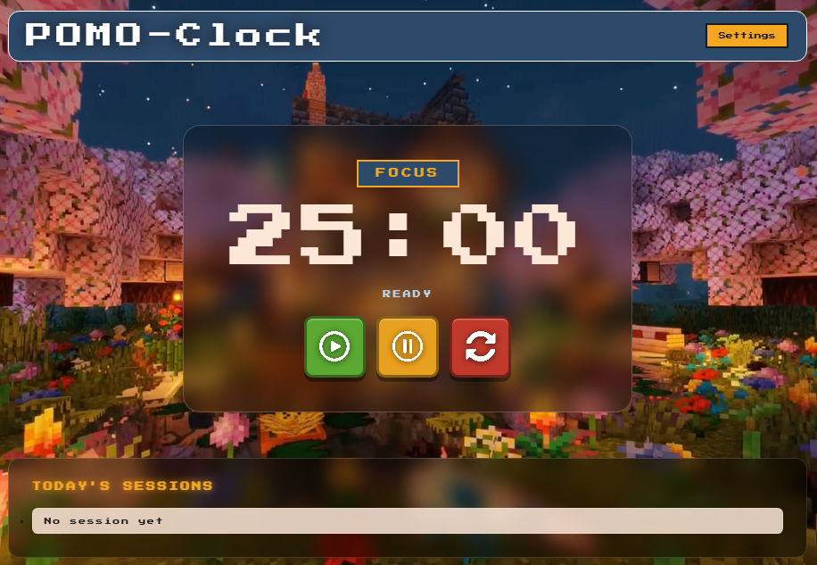
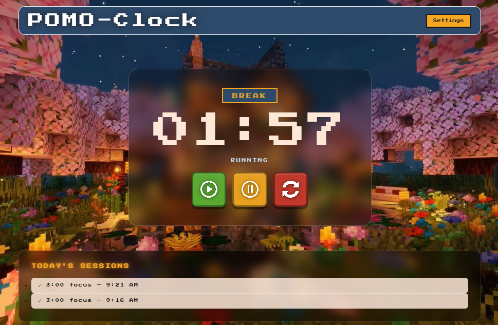
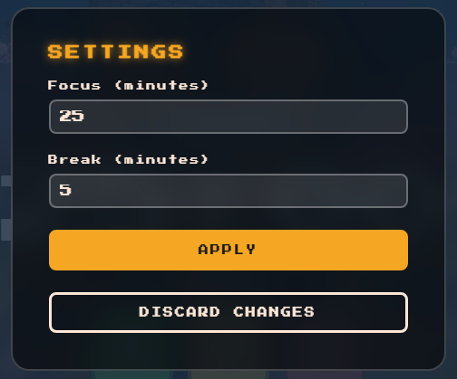

<html>
    <h1 align="center">☆⋆⭒˚.⋆ POMO-Clock ⋆.˚⭒˚⋆☆</h1>
</html>

A Pomodoro timer built with HTML, CSS, and JavaScript.

 *Built as part of the Dev Weekends Fellowship 2026 frontend assessment.*

---

## 🚀 How to Run

No installation or dependencies required, this project uses pure HTML, CSS, and JavaScript.

### Option 1 - Live Demo

https://anjanakri.github.io/POMO-clock/

### Option 2 - Run Locally

```bash
git clone https://github.com/anjanakri/POMO-clock.git
cd POMO-clock
```

Then simply open `index.html` in any browser.

> No Node.js, npm, or build tools required.

---
<h2>🖼️ App Preview</h2>
<table>
  <tr>
    <td align="center" width="860">
      <h4>🏠 Home-Ready to focus</h4>
      
        <br></br>
      <i>The main screen with the countdown timer, mode badge and Minecraft-style control buttons.</i>
    </td>
  </tr>
  <tr>
    <td align="center" width="320">
      <h4>In Session-Focus session recorded in history</h4>
      <br></br>
      <i>Timer running with a completed session logged in today's history below.</i>
    </td>
  </tr>
  <tr>
    <td align="center" width="320">
      <h4>Settings - Customize your session</h4>
      <br></br>
      <i>Settings modal to configure focus and break durations.</i>
    </td>
  </tr>
</table>

---
## ✨ Features

| Feature | Description |
|---|---|
|Countdown Timer | Real-time Pomodoro countdown displayed in `mm:ss` format |
|Timer Controls | Start, pause, resume, and reset functionality |
|Auto Session Switching | Automatically switches between Focus and Break sessions |
|Custom Settings | Configure focus and break durations through a settings modal |
|Session Chime | Audible notification using the Web Audio API |
|Daily Session History | Tracks completed sessions using `localStorage` |
|Pixel-Art UI | Minecraft-inspired blocky interface and retro styling |
|Responsive Design | Works smoothly on mobile, tablet, and desktop screens |

---

## Project Structure

```text
POMO-clock/
├── index.html           # Main app structure
├── style.css            # Styling and responsive design
├── script.js            # Timer logic and app functionality
├── README.md            # Project documentation
├── ANSWERS.md           # Fellowship assessment answers
└── assets/
    ├── play-button.png
    ├── pause-button.png
    ├── reset-button.png
    ├── fevicon.png
    └── background-wallpaper.png
```

---

## Tech Stack

| Technology | Purpose |
|---|---|
| HTML5 | App structure |
| CSS3 | Styling and responsive layout |
| JavaScript| Timer logic and interactions |
| Press Start 2P | Retro pixel-style typography |
| Web Audio API | Session completion chime |
| localStorage | Persistent daily session history |
| CSS backdrop-filter | Frosted glass visual effects |

---

## Inspiration

This project combines productivity with retro gaming aesthetics.  
The goal was to create a Pomodoro timer that feels lightweight, fun, and visually nostalgic instead of overly minimal or corporate.

I’ve always enjoyed playing Minecraft, and its iconic pixel-art aesthetic inspired the overall UI design of this project.

---

## Notes

- Session history automatically resets at midnight
- Fully frontend-based,no backend or database used
- Designed to stay simple, lightweight, and beginner-friendly

---

*Coded with ☕ and💗 by Anjana Kumari*
